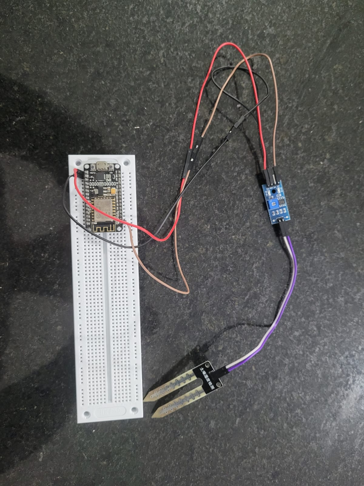
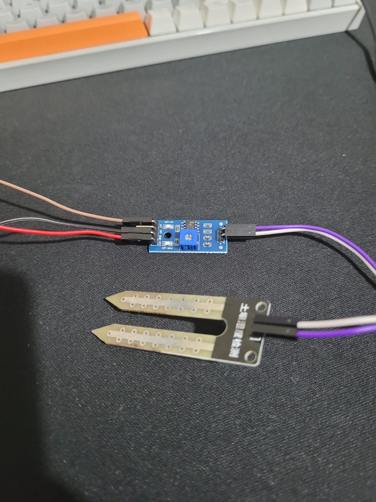
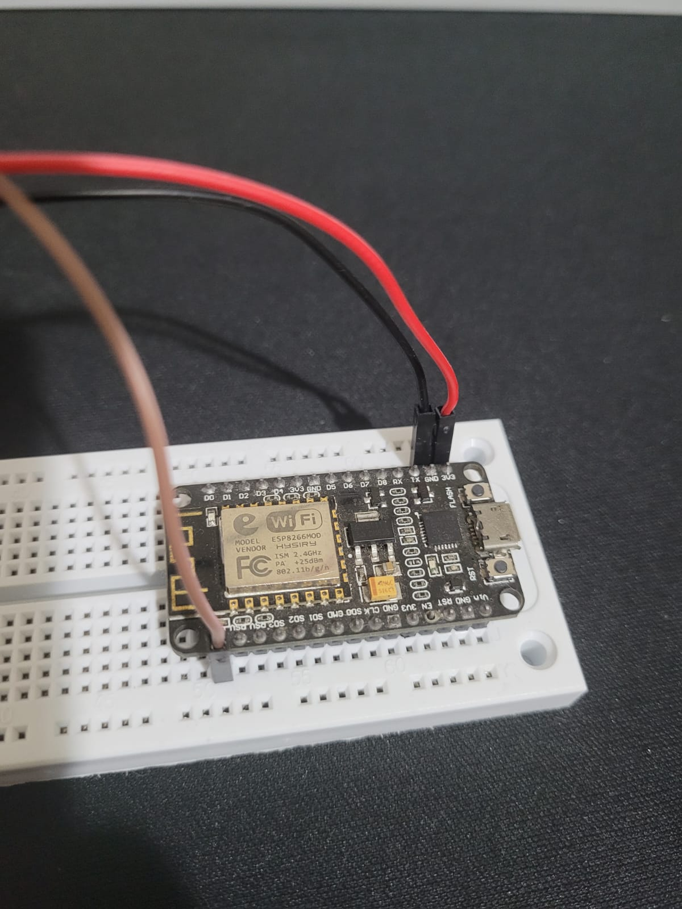
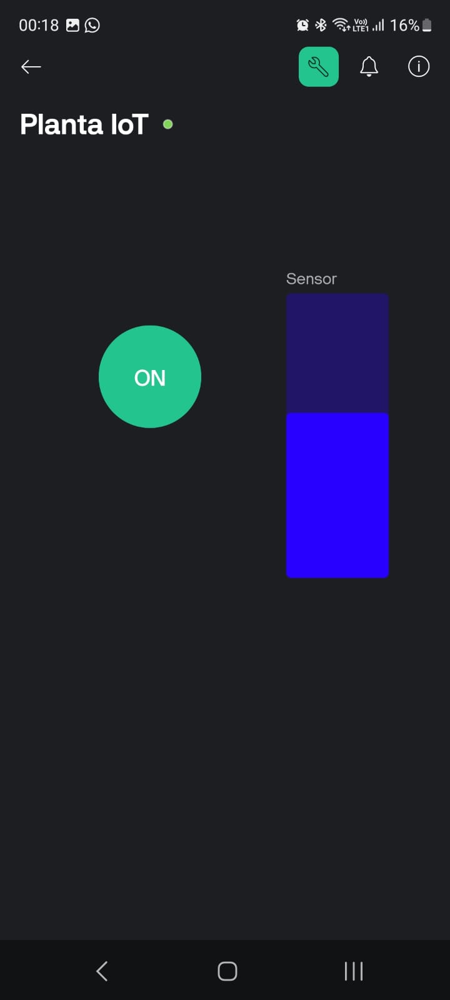
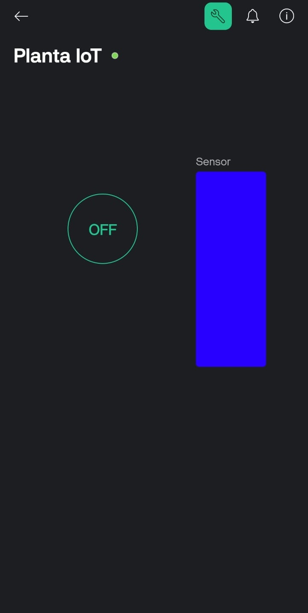

# 🌱 Planta-IoT

## Sobre o Projeto

Este projeto é um **monitor inteligente de umidade de solo** para vasos de plantas, utilizando um **MOD-WIFI-ESP8266** e o sensor YL-69, com total integração ao aplicativo Blynk.

O sistema permite acompanhar a umidade em tempo real pelo celular e controlar um LED de status, tornando o cuidado com plantas mais fácil, prático e conectado.

---

## Como Funciona

- O **sensor YL-69** mede a condutividade do solo, que varia com a umidade.
- A placa **MOD-WIFI-ESP8266** lê esse valor analógico, o converte para um percentual de umidade e o envia para a plataforma Blynk via Wi-Fi.
- No **aplicativo Blynk**, o usuário pode visualizar o nível de umidade em tempo real em um medidor e acionar um LED de status remotamente.

---

## Componentes e Esquema de Ligação

A montagem do circuito é simples, conectando o módulo sensor à placa ESP8266.

| Sensor YL-69 (Módulo) | MOD-WIFI-ESP8266 |
|:---------------------:|:----------------:|
| VCC                 | 3V3              |
| GND                 | GND              |
| AO                  | A0               |

 

| Módulo Sensor YL-69 | Placa MOD-WIFI-ESP8266 |
| :---: | :---: |
|  |  |

---

## Demonstração

Aqui vemos a correlação direta entre o estado físico da planta e o que é exibido no painel de controle do aplicativo Blynk.

### Cenário 1: Solo Menos Úmido

Quando o sensor está em um solo com menos umidade, o aplicativo reflete esse estado e permite acionar o LED de status.

| Projeto Físico | Painel no App Blynk |
| :---: | :---: |
|  |  |
| *Sensor no vaso com terra menos úmida. O LED de status na protoboard está ligado.* | *Aplicativo indicando umidade em nível médio e o botão de controle do LED na posição "ON".* |

 

### Cenário 2: Solo Úmido

Ao regar a planta ou mover o sensor para um solo saturado de água, o aplicativo atualiza em tempo real.

| Projeto Físico | Painel no App Blynk |
| :---: | :---: |
|  |  |
| *Sensor no vaso com terra bem úmida. Note o LED verde no módulo do sensor aceso intensamente.* | *Aplicativo indicando umidade máxima e o botão de controle do LED na posição "OFF".* |

---

## Passo a passo para Execução

1.  Monte o circuito conforme o esquema e as fotos acima.
2.  Programe a placa MOD-WIFI-ESP8266 com o código-fonte do projeto (não esquecer de preencher suas credenciais de Wi-Fi e o Auth Token do Blynk).
3.  No app Blynk, configure os widgets nos pinos virtuais corretos (Gauge em V2, Botão em V1).
4.  Ligue o projeto (de preferência em uma fonte de energia externa, como um carregador de celular) e acompanhe os dados em tempo real!

---

## Recursos do Projeto

- Monitoramento remoto de umidade em tempo real.
- Controle de um atuador (LED) remotamente via app.
- Plataforma de fácil visualização e expansão (Blynk).

---

## Créditos

* **Desenvolvido por:** Luiza de Martha e Nicholas Siécola
* **Disciplina:** Conceitos e Tecnologias para Dispositivos Conectados (C115)
* **Professor:** Samuel Baraldi Mafra